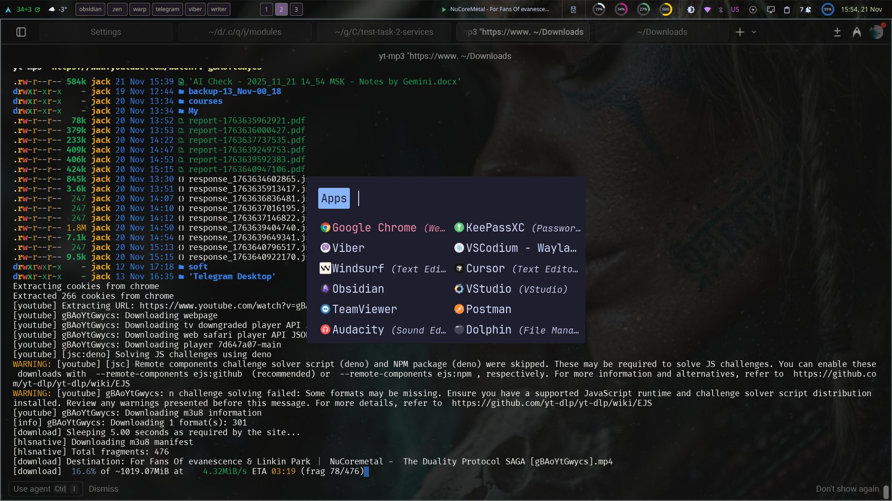
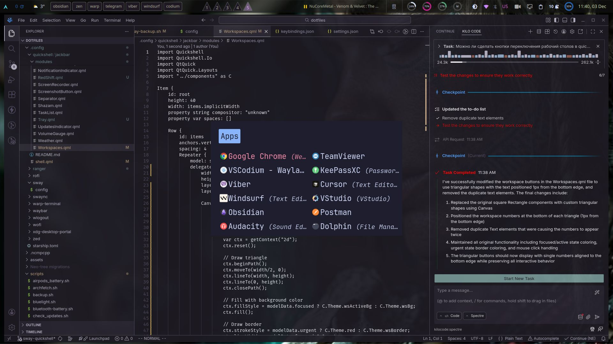

[](https://git.io/typing-svg)

- .gitconfig
- TMUX config
- popular terminals config (kitty, alacritty, ghostty)
- neovim config (based on LazyVim)
- fish config (+ a bit of zsh customization)
- hyprland/waybar config

<br />
<details close>
<summary>Paru Installation</summary>

```sh
    sudo pacman -S --needed base-devel
    git clone https://aur.archlinux.org/paru.git
    cd paru
    makepkg -si
```

</details>

### Install `Hyprland` packages

```bash
    sudo pacman -S --needed hyprland swayimg waybar rofi swaync obs-studio jq wl-clipboard libnotify copyq figlet gum xdg-desktop-portal xdg-desktop-portal-hyprland
    paru -S --needed hyprpicker arch-update hyprwall swaybg mpvpaper hyprpicker scrot xclip hyprshot brightnessctl hyprpolkitagent hyprsunset hyprsysteminfo hypridle hyprswitch nwg-dock-hyprland swaylock-effects swww waypaper walker-bin
```

### Install related packages

```bash
    sudo pacman -S ttf-font-awesome ttf-fira-sans ttf-fira-code ttf-firacode-nerd ttf-droid ttf-jetbrains-mono ttf-jetbrains-mono-nerd gnome-calendar mpd ncmpcpp networkmanager-dmenu brightnessctl ttf-firacode-nerd kdeconnect fastfetch neofetch curl nushell starship tmux cmatrix cowfortune power-profiles-daemon mpv sass dysk
    paru -S ttf-cascadia-code-nerd mission-center resources checkupdates-with-aur warp-terminal-bin rxfetch ttf-material-design-icons ttf-maple-beta chafa wf-recorder python-pywal
```

<br />
<details close>
<summary>Hyprshot GUI Installation</summary>

```sh
    git clone https://github.com/s-adi-dev/hyprshot-gui.git
    cd hyprshot-gui
    ./install.sh
```

</details>

### Install dotfiles using `Stow` & implement configs

```bash
    sudo pacman -S stow
    git clone --depth 1 https://github.com/jackpts/dotfiles.git ~/dotfiles
    cd ~/dotfiles
    stow .
```

If error occured with conflicting configs (hyprland, fish, etc.), then stow like this:

```bash
    stow . --adopt
    git stash
```

### Remove all `Stow` configuration symlinks

```bash
    stow -D .
```

### Change screen resolution & refresh rate in `$HOME/dotfiles/.config/hypr/hyprland.conf` to your own:

```conf
# monitor=,preferred,auto,1
monitor = eDP-1, 2560x1600@165, auto, 1
```

### SDDM Themify

```bash
    bash $HOME/scripts/sddm_setup_theme.sh
```

### Plymouth Themify

```bash
    sudo mkdir /usr/share/plymouth/themes/
    sudo pacman -S plymouth
    git clone https://github.com/MrVivekRajan/Plymouth-Themes.git
    cd Plymouth-Themes
    sudo cp -vr {Deadlight,Ironman,Starlord,Anonymous} /usr/share/plymouth/themes/
    bash $HOME/scripts/plymouth_setup_theme.sh
```

<br />
<details close>
<summary>Screenshots</summary>
    <p align="center">
        
        <br />
        
        <br />
        
    </p>
</details>
<br />

### Terminals Themify

- use the fish `term_theme` abbr in your current terminal or type `wal -i <wallpaper_path>` directly


### Waybar styling

1) use ./.config/waybar/style.scss file
2)  after making changes:
    a)
- convert it to CSS file:
```
    sass style.scss style.css
```
- then go to new CSS file and remove the 1st line: `@charset "UTF-8"`
OR:
    b) run fish function: `w_styles`


### BlazinLock installing
```sh
git clone https://github.com/Thunder-Blaze/BlazinLock/ ~/BlazinLock
cd ~/BlazinLock
chmod +x installer.sh
./installer.sh
```

### TODO

- kbd switcher doesn't work by clicking on waybar icon
- dropdown menus like in mechabar ( <https://github.com/sejjy/mechabar?tab=readme-ov-file> ) for WiFi, BT, Power
- set bar & widgets by `fabric` framework (best python replacement of eww/ags tools). Examples: <https://github.com/Fabric-Development/fabric/tree/main/examples>
- make left sidebar with "AI chat integration with external providers (Gemini, OpenAI...)" like in: <https://www.reddit.com/r/unixporn/comments/1im22sn/hyprland_yet_another_hyprland_rice/>
- move from `systemd` to `runit` ? (like here: <https://www.reddit.com/r/unixporn/comments/1j0w0id/swayfx_my_first_rice/#lightbox>)

