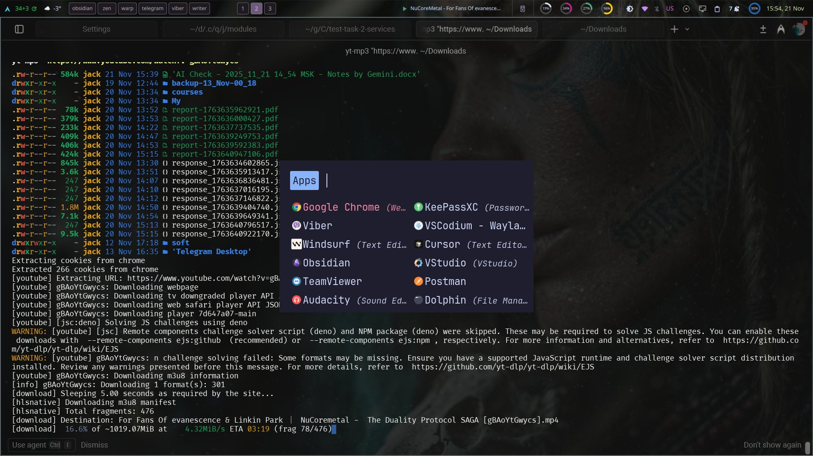
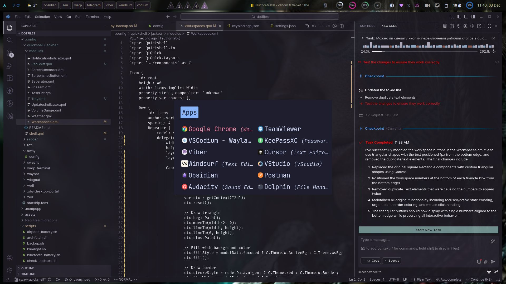
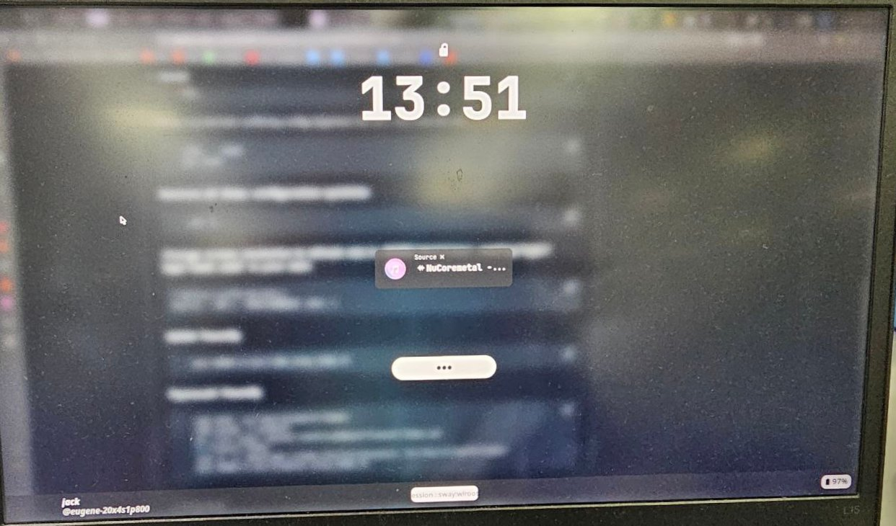
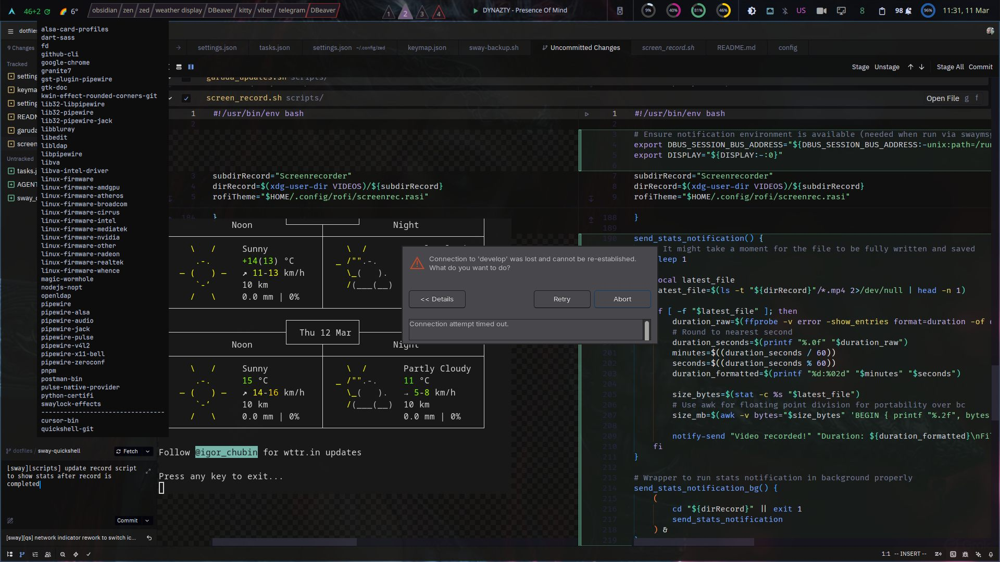

[](https://git.io/typing-svg)

- .gitconfig
- TMUX config
- popular terminals config (kitty, alacritty, ghostty)
- neovim config (based on LazyVim)
- fish config (+ a bit of zsh customization)
- sway/quickshell/waybar config
- Zed editor config (+ extensions)

<br />
<details close>
<summary>Paru Installation</summary>

```sh
    sudo pacman -S --needed base-devel
    git clone https://aur.archlinux.org/paru.git
    cd paru
    makepkg -si
```

</details>

### Install `Sway` packages

```bash
    sudo pacman -S --needed sway swayidle swaylock swaybg swayimg waybar rofi swaync obs-studio jq wl-clipboard wl-mirror cliphist copyq figlet gum xdg-desktop-portal xdg-desktop-portal-wlr polkit-gnome brightnessctl playerctl grim slurp wf-recorder mpvpaper
    paru -S --needed quickshell arch-update scrot xclip swayshot brightnessctl swww waypaper walker-bin songrec
```

### Install related packages

```bash
    sudo pacman -S ttf-font-awesome ttf-fira-sans ttf-fira-code ttf-firacode-nerd ttf-droid ttf-jetbrains-mono ttf-jetbrains-mono-nerd gnome-calendar mpd ncmpcpp networkmanager-dmenu brightnessctl ttf-firacode-nerd kdeconnect fastfetch neofetch curl nushell starship tmux cmatrix cowfortune power-profiles-daemon mpv sass dysk
    paru -S ttf-cascadia-code-nerd mission-center resources checkupdates-with-aur warp-terminal-bin rxfetch ttf-material-design-icons ttf-maple-beta chafa wf-recorder python-pywal
```

### Sway screensaver (asciiquarium overlay)

Sway uses `~/dotfiles/scripts/asciiquarium_lock.sh` for both manual (`$mod+L`) and idle triggers. Install the ASCII aquarium dependency first (kitty is already covered in the terminal section, but is required):

```bash
    sudo pacman -S asciiquarium
```

When either dependency is missing, the shortcut simply notifies you and exits—no traditional lock screen is launched.

<br />

### Install dotfiles using `Stow` & implement configs

```bash
    sudo pacman -S stow
    git clone --depth 1 https://github.com/jackpts/dotfiles.git ~/dotfiles
    cd ~/dotfiles
    stow .
```

If error occured with conflicting configs (sway, fish, etc.), then stow like this:

```bash
    stow . --adopt
    git stash
```

### Remove all `Stow` configuration symlinks

```bash
    stow -D .
```

### Change screen resolution & refresh rate in `$HOME/dotfiles/.config/sway/config` to your own:

```conf
output eDP-1 mode 2560x1600@165Hz position 0,0
```

### SDDM Themify

```bash
    bash $HOME/scripts/sddm_setup_theme.sh
```

### Plymouth Themify

```bash
    sudo mkdir /usr/share/plymouth/themes/
    sudo pacman -S plymouth
    git clone https://github.com/MrVivekRajan/Plymouth-Themes.git
    cd Plymouth-Themes
    sudo cp -vr {Deadlight,Ironman,Starlord,Anonymous} /usr/share/plymouth/themes/
    bash $HOME/scripts/plymouth_setup_theme.sh
```

<br />
<details close>
<summary>Screenshots</summary>
    <p align="center">
        
        <br />
        
        <br />
        
        <br />
        
    </p>
</details>
<br />

### Zed Editor

Install Zed extensions and MCP servers from dotfiles:

```bash
    ./scripts/install-zed-extensions.sh
```

Configuration files:
- `.config/zed/extensions.json` - Installed extensions (syntax highlighting, languages)
- `.config/zed/servers.json` - MCP context servers and AI agent servers

### Terminals Themify

- use the fish `term_theme` abbr in your current terminal or type `wal -i <wallpaper_path>` directly

### Backup

Run the backup script manually or wait for auto-start on Sway login:

```bash
    ./scripts/sway-backup.sh
```

**Auto-start:** The backup runs automatically 20 seconds after Sway starts (configured in `.config/sway/config`).

**Notification:** After completion, a desktop notification shows:
- Backup file name
- Archive size

**yt-tg-chat-bot:** Auto-starts in kitty terminal on workspace 2 (25 second delay).

This creates backups of:
- Pacman packages (official + AUR)
- Flatpak packages
- GNOME extensions (commented out - not using GNOME)
- **Zed editor extensions**
- **Zen browser**: extensions, bookmarks, session (tabs/workspaces)
- Nemo dconf settings
- System configs (/etc/, dotfiles, SSH, GPG, etc.)
- MySQL dump (commented out temporarily)
- System themes rsync (commented out temporarily)

**Configuration:**
- Output: `/run/media/jacky/back2up/regular/`
- Password: (see `scripts/sway-backup.sh`, `BACKUP_PASSWORD` variable)
- Compression: Maximum (7z -mx=9)
- Archive format: Encrypted 7zip


### Waybar styling

1) use ./.config/waybar/style.scss file
2)  after making changes:
    a)
- convert it to CSS file:
```
    sass style.scss style.css
```
- then go to new CSS file and remove the 1st line: `@charset "UTF-8"`
OR:
    b) run fish function: `w_styles`


### TODO

- dropdown menus like in mechabar ( <https://github.com/sejjy/mechabar?tab=readme-ov-file> ) for WiFi, BT, Power
