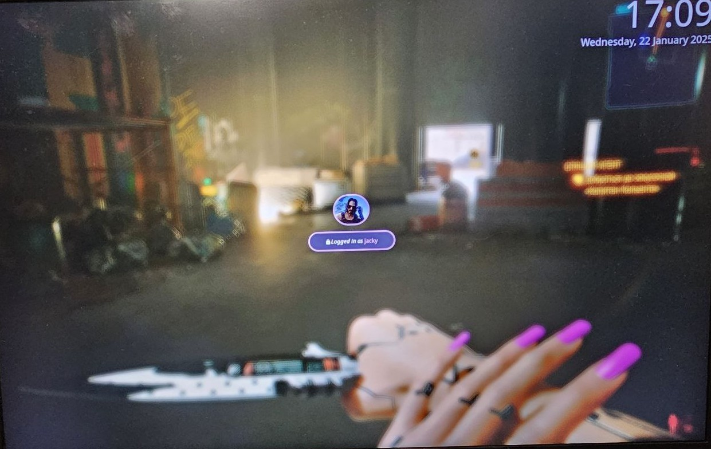

[](https://git.io/typing-svg)

- .gitconfig
- TMUX config
- popular terminals config (kitty, alacritty, ghosty)
- neovim config (based on LazyVim)
- fish config (+ a bit of zsh customization)
- hyprland/waybar config

### Install `Hyprland` packages

```bash
    sudo pacman -S --needed hyprland starship swayimg waybar rofi swaync obs-studio jq wl-clipboard libnotify nitrogen copyq figlet gum
    yay -S --needed hyprpicker arch-update hyprwall swaybg hyprlock hyprpicker scrot xclip hyprshot brightnessctl hyprpolkitagent hyprsunset hyprsysteminfo hypridle hyprswitch nwg-dock-hyprland swww waypaper
```

### Install other packages

```bash
    sudo pacman -S ttf-font-awesome ttf-fira-sans ttf-fira-code ttf-firacode-nerd ttf-droid ttf-jetbrains-mono ttf-jetbrains-mono-nerd gnome-calendar mpd ncmpcpp networkmanager-dmenu brightnessctl wf-recorder
    yay -S ttf-cascadia-code-nerd mission-center resources checkupdates-with-aur paru walker-bin warp-terminal-bin
    paru -S ttf-maple-beta

```

### Install dotfiles using `Stow` & implement configs

```bash
    sudo pacman -S stow
    git clone --depth 1 https://github.com/jackpts/dotfiles.git ~/dotfiles
    cd ~/dotfiles
    stow .
```

### SDDM Themify

```bash
    bash $HOME/scripts/sddm_setup_theme.sh
```

### Plymouth Themify

```bash
    sudo mkdir /usr/share/plymouth/themes/
    sudo pacman -S plymouth
    git clone https://github.com/MrVivekRajan/Plymouth-Themes.git
    cd Plymouth-Themes
    sudo cp -vr {Deadlight,Ironman,Starlord,Anonymous} /usr/share/plymouth/themes/
    bash $HOME/scripts/plymouth_setup_theme.sh
```

<br />
<details close>
<summary>Screenshots</summary>
    <p align="center">
        
        <br />
        
        <br />
        
    </p>
</details>
<br />

### TODO

- kbd switcher doesn't work by clicking on waybar icon
- dropdown menus like in mechabar ( <https://github.com/sejjy/mechabar?tab=readme-ov-file> ) for WiFi, BT, Power
- LazyGit custom theme add (or set of)
- KDE Connect waybar integration / display battery % of phone-watches?
- set bar & widgets by `fabric` framework (best python replacement of eww/ags tools). Examples: <https://github.com/Fabric-Development/fabric/tree/main/examples>
- make left sidebar with "AI chat integration with external providers (Gemini, OpenAI...)" like in: <https://www.reddit.com/r/unixporn/comments/1im22sn/hyprland_yet_another_hyprland_rice/>
- move from `systemd` to `runit` ? (like here: <https://www.reddit.com/r/unixporn/comments/1j0w0id/swayfx_my_first_rice/#lightbox>)
